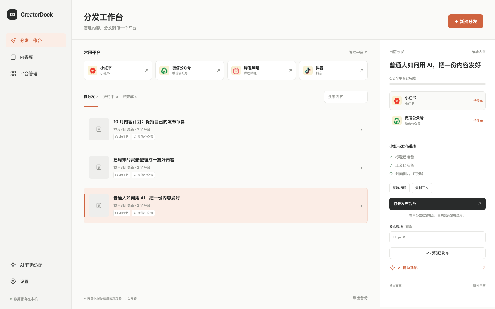

# CreatorDock 分发工作台 · 2026-10-03

本次按已确认的 UI 方向实现：多平台内容分发与管理是主流程，AI 写作与封面生成作为辅助入口保留。

## 打开与使用

- 本机预览：`http://127.0.0.1:5187/CreatorDock/`。
- 解压可运行包后，macOS 双击 `启动CreatorDock.command`；需要 Python 3.9+。也可运行 `python3 scripts/serve-built.py`。
- 如果已有旧 PWA，点击“立即更新”。原账号配置和写作内容仍保留在同一浏览器站点。
- 在“新建分发”填写标题、正文、选择平台，可上传最大 2 MB 的 PNG / JPG / WebP 封面。
- 右侧切换目标平台，复制标题/正文，打开发布后台；在平台完成发布后，返回记录发布结果和可选链接。
- “待分发 / 进行中 / 已完成”按每个平台的实际手动记录计算，可撤销错误标记。
- “编辑内容”可为平台单独调整文案；“内容库”支持搜索、归档、恢复。
- AI 辅助可追加当前内容到已有草稿；内容包完成后，可将已完成且仍有对应平台入口的稿件加入分发队列。原 AI 内容包保留。

## 数据行为

分发记录使用独立本地存储，不覆盖旧账号配置、模型配置或写作历史。封面随记录保存在当前浏览器；不同端口、浏览器或设备的数据不会自动同步。默认不创建示例内容，文档截图中的内容来自隔离测试。

设置页可导出/导入分发 JSON 备份。导入合并记录，同 ID 的不同内容保留为副本。原有平台配置导入/导出继续可用。单份内容支持 Markdown 导出、封面下载。

存储写入失败时保留页面中的内容，并提醒立即导出、不要刷新。发现损坏数据时阻止覆盖，提供原始数据下载与修复后导入。归档是可恢复操作。

## 界面

浅色三栏桌面布局；中等窗口调整平台卡片列数；手机使用底部导航和独立分发详情。保留原有主题与密度设置。新版业务文案以中文为主，原有平台管理与 AI 模块保留中英文切换。



## 首轮验证结果

- TypeScript 编译通过。
- 单元/组件测试：23 个文件、145 项通过。
- 生产构建、资源路径与 PWA 缓存检查通过。
- 浏览器端到端测试：21 项通过；另对最终截图单独验收通过。
- 覆盖：新建分发、复制、逐平台发布/链接校验、刷新恢复、平台独立文案、导出、归档恢复、损坏存储保护、存储满时导出、AI 草稿衔接、旧内容包加入队列、封面校验与下载、备份冲突合并、移动端和离线加载。
- 原有账号增改删、重排、快捷方式导出、AI 部分失败重试、停止与恢复测试继续通过。
- 界面在实际浏览器中查看；桌面截图采用 1586×990，移动端功能测试采用 390×844。

首轮浏览器验收曾出现以下失败，未删除或跳过测试：

```text
mobile writing navigation ... Test timeout of 30000ms exceeded
getByRole('tab', { name: '进行中 1' }) ... element(s) not found
locator.selectOption ... getByLabel('选择平台', { exact: true })
locator.fill ... getByLabel('平台正文', { exact: true })
```

分别修复窄屏导航可访问名称、状态标签可访问名称以及编辑控件的明确标签。复测全部通过。人工检查另发现更新提示被手机底部导航遮挡，已调整提示层级和底部间距；最终构建与资源检查再次通过。测试导航与旧首页布局断言根据本次已批准的产品布局变更更新，原有行为覆盖保留。

## 边界

本次交付是本地网页/PWA，发布仍需用户在各平台后台完成；未声称自动发布、统一登录或平台数据同步。模型测试使用模拟响应，未使用用户密钥或产生付费请求。未运行原生 Tauri/签名安装包和 Windows PowerShell 测试；此阶段尚未推送 GitHub 或对外部署；后续上传情况以仓库提交和 Release 为准。

## 追加完善与核验

本轮聚焦数据完整性，保留上述界面与操作流程。

- 修复旧标签页保存覆盖其他标签页新增内容的问题：保存前读取最新记录，仅合并本页发生的修改。
- 两个标签页修改同一份内容时，保留当前版本与另一版本的“冲突副本”，并在界面提示用户核对。
- 检测到存储在操作期间损坏时停止覆盖，保留页面中的内容供导出；导入修复备份时，也保留页面上未修改的旧记录。
- 备份导入严格检查日期为字符串，以及账号 ID、名称、可选平台标识和浏览器 Profile 字段类型。
- 新增 Markdown 导出回归，确认真实换行和用户正文中的字面转义都能保留；该检查在修复前已通过，未更改导出实现。

本轮先复现的失败包括：

```text
rejects non-string dates ... expected [Function] to throw an error
查看分发：另一标签页新增内容 ... element(s) not found
查看分发：应该保留的内容 ... element(s) not found
```

这些测试分别覆盖非法备份、旧标签页保存以及外部损坏恢复，不删除或弱化既有断言。跨标签页验证覆盖顺序保存和打开旧编辑器后保存；这仍是浏览器本地存储应用，不是服务器多人实时协作系统。

追加核验结果：148 项单元/组件测试通过，24 项生产浏览器端到端测试通过，TypeScript、生产构建、PWA 资源检查和 `git diff --check` 通过。二次交付文件为 `CreatorDock-分发工作台-20261003-核验版.zip`，上一交付包保留。

## 中文手册与上传交付

新增 [中文图文使用说明](USER_GUIDE.zh-CN.md)，包含 9 张真实界面截图；同步更新 README 和快速开始。截图使用演示素材。

上传前再次运行：148 项单元/组件测试、24 项浏览器测试、TypeScript、生产构建、资源检查、37 张图标和文档相对链接检查均通过。图标检查首次因系统 Python 缺少 PIL 失败，改用已安装 Pillow 的配套 Python 重跑通过，未修改测试。

运行包包含源码、dist、启动脚本和图文说明，不包含 node_modules、Git 元数据、浏览器数据或密钥。本次仍未执行原生安装器、Windows PowerShell 或真实付费模型验收。
