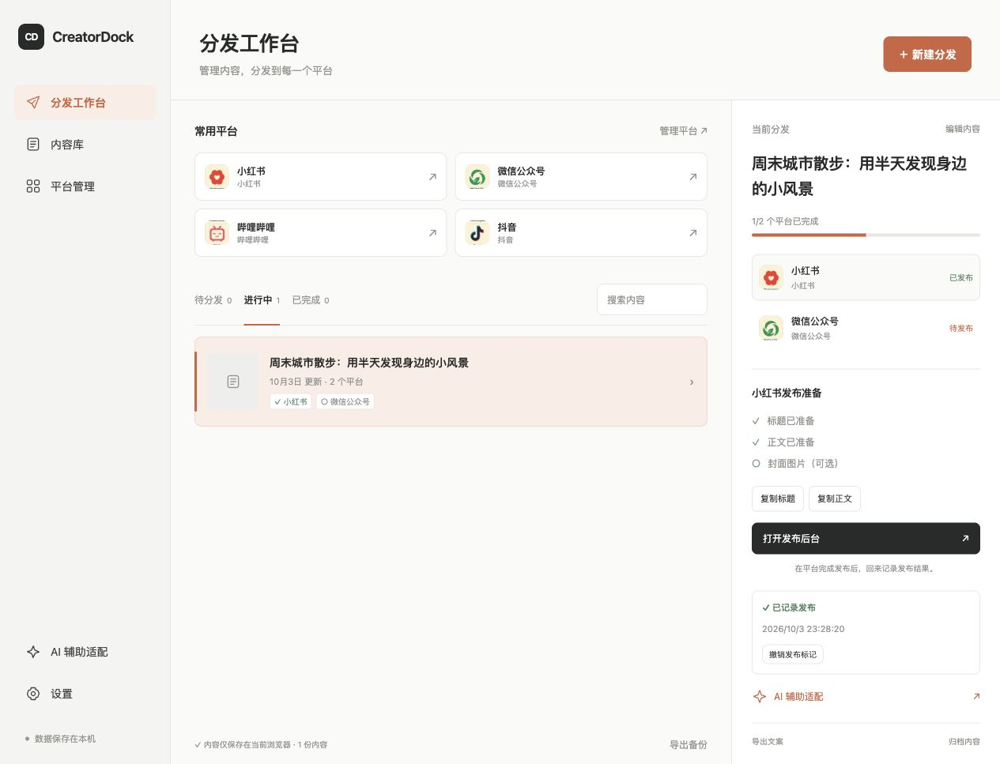
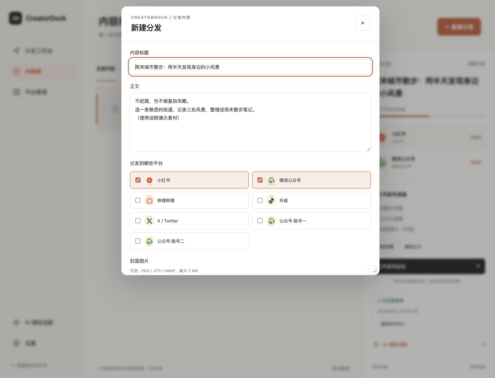
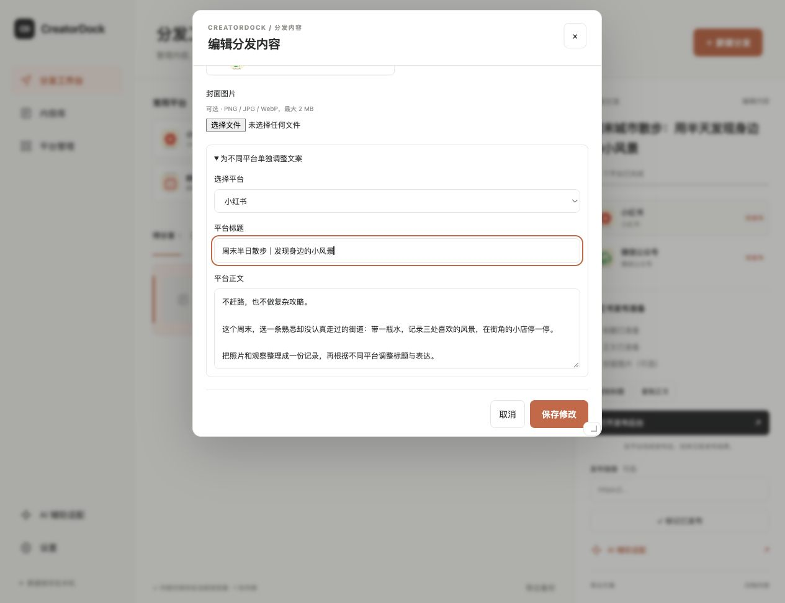
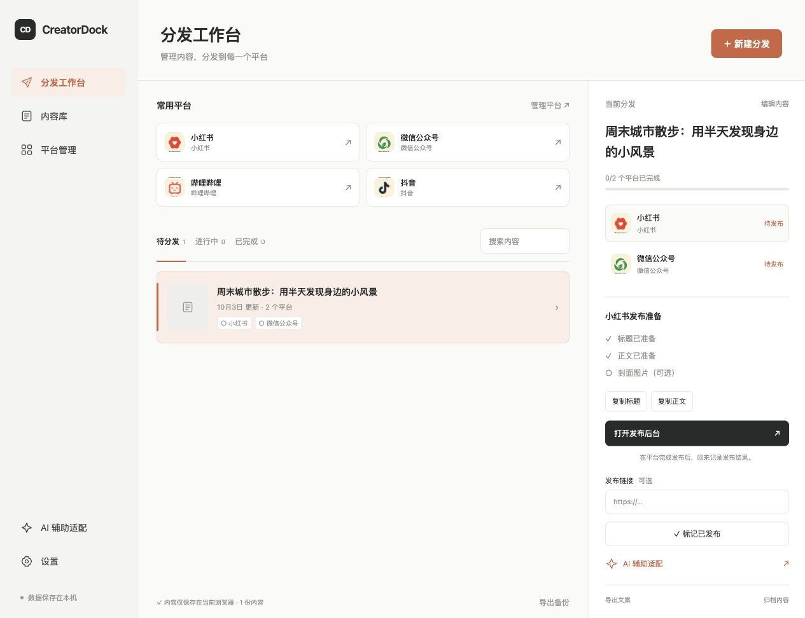
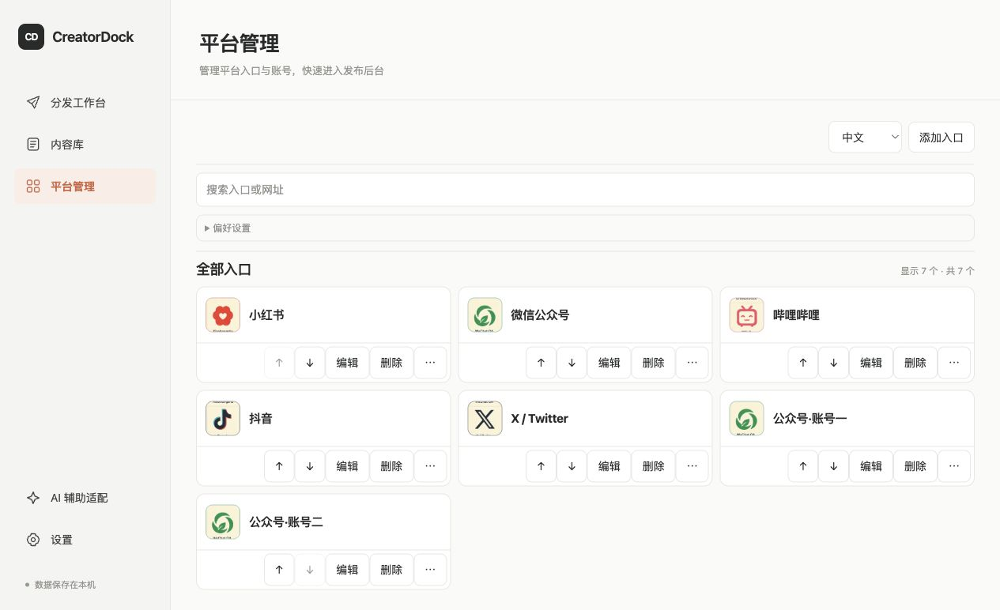
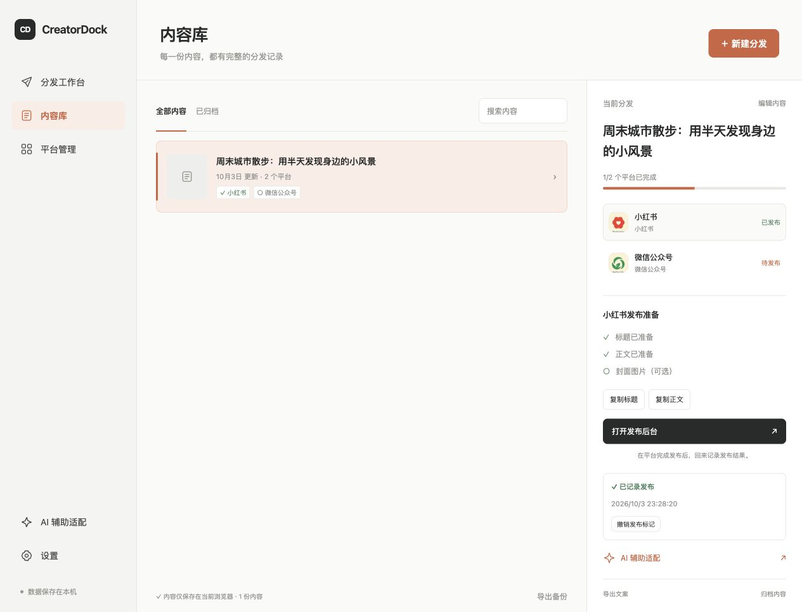
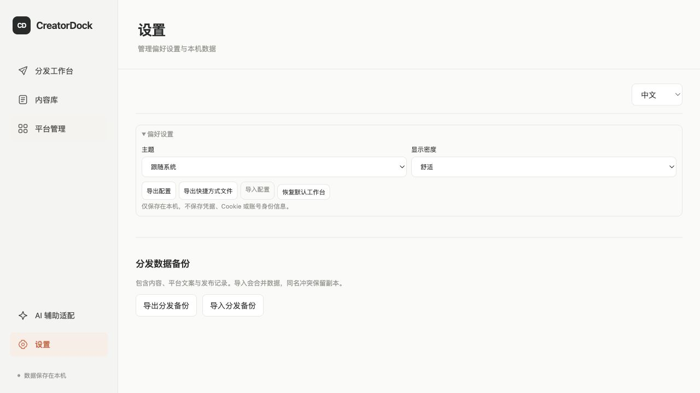
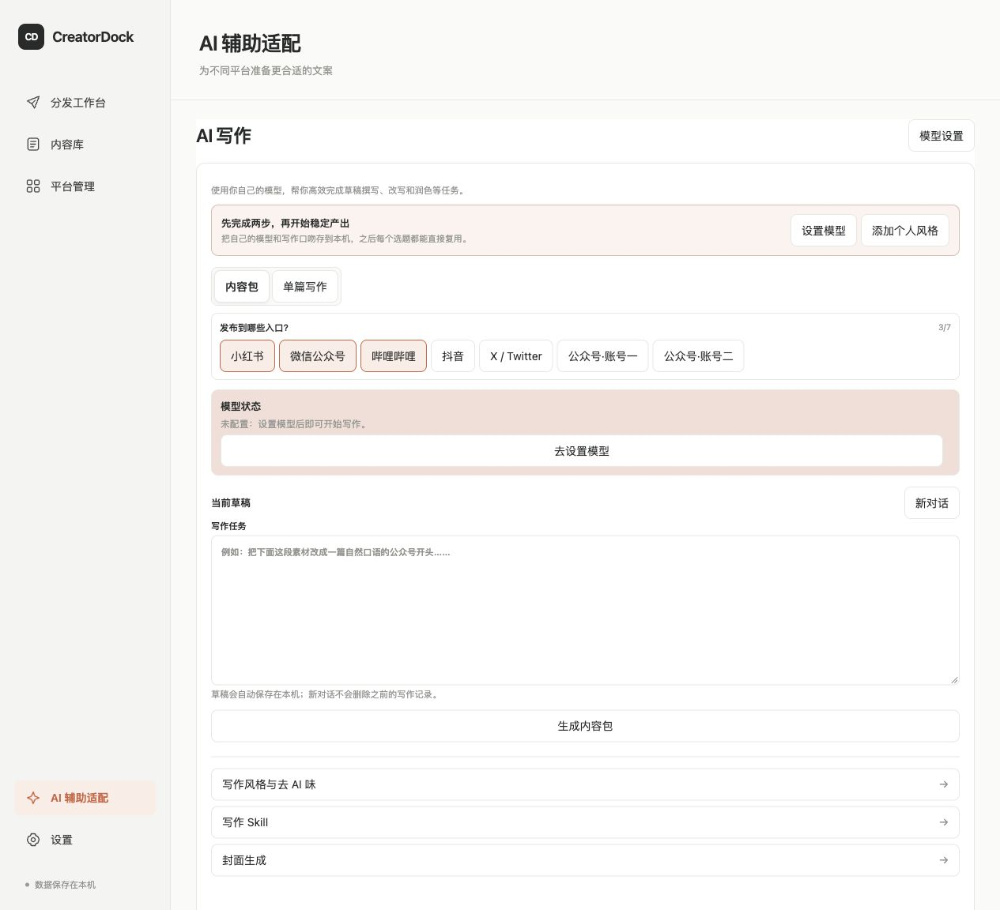
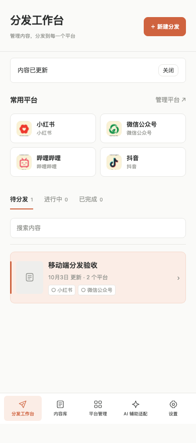

# CreatorDock 中文图文使用说明

适用版本：2026-10 分发工作台。截图来自实际运行页面，内容与发布标记均为演示数据，没有向外部平台发文。

CreatorDock 帮你把一份内容分发到多个平台，并集中管理入口、平台专用文案和发布进度。**日常分发无需配置 AI，也无需 API Key。**



## 目录

1. [安装与打开](#1-安装与打开)
2. [认识工作台](#2-认识工作台)
3. [创建第一份分发内容](#3-创建第一份分发内容)
4. [为不同平台调整文案](#4-为不同平台调整文案)
5. [逐个平台发布并记录结果](#5-逐个平台发布并记录结果)
6. [管理平台和账号入口](#6-管理平台和账号入口)
7. [查找、归档与恢复内容](#7-查找归档与恢复内容)
8. [备份与换设备](#8-备份与换设备)
9. [可选的-ai-辅助](#9-可选的-ai-辅助)
10. [手机布局与常见问题](#10-手机布局与常见问题)

## 1. 安装与打开

### 使用本次免前端依赖运行包

在 [GitHub Releases](https://github.com/huhappy318-coder/CreatorDock/releases) 下载附件 **CreatorDock-ready-20261003.zip**，完整解压后再启动。它包含源码、构建好的网页、启动脚本和本说明；不是 `.dmg` 或 `.exe` 桌面安装器。

- **macOS：**安装 Python 3.9 或更高版本后，双击包内 `启动CreatorDock.command`。如果不能双击，在终端进入解压目录执行下方命令。
- **其他系统：**需要 Python 3.9 或更高版本，在解压目录打开终端运行；Windows 的命令可能是 `python` 或 `py`。

```sh
python3 scripts/serve-built.py
```

浏览器会打开 `http://127.0.0.1:5187/CreatorDock/`。保持启动终端运行，退出服务按 `Ctrl+C`。请固定使用这个地址，便于持续访问同一份本地数据。

> GitHub 自动提供的 “Source code (zip)” 只有源码，不包含 `dist/`，不能直接使用上述免构建方式。请下载指定附件。

### 从源码运行

安装 Node.js 20+ 与 npm，在项目目录执行：

```sh
npm ci
npm run dev
```

打开终端显示的地址。若需要生成供本地启动脚本使用的生产文件，在 macOS/Linux 执行：

```sh
CREATORDOCK_BASE_PATH=/CreatorDock/ npm run build
python3 scripts/serve-built.py
```

Windows PowerShell 对应构建命令：

```powershell
$env:CREATORDOCK_BASE_PATH = '/CreatorDock/'
npm run build
python scripts/serve-built.py
```

Releases 中其他历史版本的 `.dmg` 或 `.exe` 不一定包含本次界面，请核对版本说明。本次运行包在 macOS 本地网页环境核验；不代表原生桌面安装器已验证。

## 2. 认识工作台

| 入口 | 用来做什么 |
| --- | --- |
| 分发工作台 | 查看待分发、进行中、已完成的内容；打开常用平台 |
| 内容库 | 查找内容、查看已归档内容和恢复记录 |
| 平台管理 | 添加、编辑、排序平台及账号入口 |
| AI 辅助适配 | 可选：用自己的模型生成、改写平台文案 |
| 设置 | 导入导出数据、调整主题和显示密度 |

电脑宽屏下，左侧是导航，中间是内容队列，右侧是当前内容的分发详情。首次使用队列为空是正常现象；截图中的演示内容不会自动加入你的工作台。

## 3. 创建第一份分发内容

1. 点击右上角 **“＋ 新建分发”**。
2. 填写 **内容标题** 和 **正文**，两项都不能为空。内容标题最多 200 字符。
3. 在 **“分发到哪些平台”** 中至少选择一个平台。可以同时选择多个账号入口。
4. 如需封面，选择 PNG、JPG 或 WebP 图片，大小不超过 2 MB；也可以先不添加。
5. 向下滚动弹窗，点击 **“创建分发”**。新内容进入“待分发”队列。



*图：新建分发弹窗。较矮的窗口需要在弹窗内滚动，才能看到底部创建按钮。*

准备好的内容保存在当前浏览器。创建分发只是建立待办记录，不会发送内容到平台。

## 4. 为不同平台调整文案

例如，同一份散步笔记可以给小红书用短标题，给公众号保留完整标题。

1. 点击队列中的内容，选择右侧 **“编辑内容”**。
2. 展开 **“为不同平台单独调整文案”**。
3. 在 **“选择平台”** 中选择目标平台。
4. 修改 **“平台标题”**、**“平台正文”**，然后点击 **“保存修改”**。
5. 需要调整其他平台时，再次进入编辑并切换目标。



修改公共标题或正文时，仍与原公共文案相同的平台版本会随之更新；已经单独改过的对应字段会保留。发布前请逐个平台核对。

已标记发布的平台不能直接取消勾选；需要先撤销发布标记。编辑 CreatorDock 中的文案不会修改平台上已经发布的文章。

## 5. 逐个平台发布并记录结果

1. 在内容队列选中一份内容，再在右侧选中一个平台。
2. 点击 **“复制标题”** 和 **“复制正文”**，分别粘贴到平台对应字段。已添加封面时，可点击 **“下载封面”** 保存图片后上传。
3. 点击 **“打开发布后台”**，在平台中登录正确账号、检查排版和素材，完成实际发布。
4. 返回 CreatorDock，可在 **“发布链接”** 中填写文章链接，也可以留空。
5. 确认实际发布成功后，点击 **“标记已发布”**。
6. 选择下一个平台，重复以上操作。



*图：标题、正文和封面准备情况，以及打开后台、记录发布结果的入口。*

| 队列状态 | 判定方式 |
| --- | --- |
| 待分发 | 所有目标平台都还没有发布标记 |
| 进行中 | 部分平台已标记，仍有平台待发布 |
| 已完成 | 所有目标平台均已标记 |


误点了发布标记，可点击 **“撤销发布标记”**。这只修改本地记录，不会删除平台文章。填写过发布链接的记录可通过 **“查看已发布内容”** 返回文章。

**CreatorDock 不会自动登录、自动发文或读取平台审核结果。** “已发布”是你手动记录的结果，并非平台接口确认。视频、图集和排版等仍需在对应平台完成。

## 6. 管理平台和账号入口

点击左侧 **“平台管理”**。



- **添加：**点击“添加入口”，从预设选择平台或填写自定义 HTTP(S) 网址，设置便于识别的名称并保存。
- **编辑：**点击卡片上的“编辑”，修改名称和后台网址。
- **排序：**用上下箭头调整顺序。首页常用平台显示靠前的入口。
- **同平台多账号：**通过“更多操作”复制入口，再改成不同标签，例如“公众号·生活记录”“公众号·工作项目”。
- **删除：**在卡片上点击“删除”，按页面提示确认。删除前确认该入口不再需要。

默认的“公众号·账号一 / 账号二”只是示例入口名称，不表示已经连接或登录了两个账号。

浏览器版管理的是账号**标签与链接**，同一浏览器的站点登录状态可能共享。每次打开平台后台，请核对当前登录账号。Windows 桌面版的 Chrome/Edge Profile 配置属于另外的高级功能，详见 [项目说明](../README.md#windows-本地-launcher-与快捷方式-helper)。

## 7. 查找、归档与恢复内容

点击 **“内容库”**，用搜索框查找内容，点击记录查看各平台的发布情况。



- 暂时不需要出现在工作队列中：选中内容，点击详情底部 **“归档内容”**。
- 归档后找回：进入内容库的 **“已归档”**，选中记录，点击 **“恢复内容”**。
- 操作后如出现撤销入口，也可立即撤销归档。
- 需要复制到文档或留档：点击详情底部 **“导出文案”**，下载 Markdown 文件。

归档不删除内容。Markdown 文案导出用于阅读和整理；恢复应用记录应使用下一节的 JSON 分发备份。

## 8. 备份与换设备

点击左侧 **“设置”**，区分以下几种导出。



| 按钮 | 包含内容 | 恢复入口 |
| --- | --- | --- |
| 导出分发备份 | 内容、封面、各平台文案和发布记录，包括归档记录 | 导入分发备份 |
| 导出配置 | 平台入口、账号标签及界面偏好等配置 | 导入配置 |
| 导出快捷方式文件 | Windows 快捷方式 helper 使用的入口文件 | 按项目说明运行 helper |
| 模型设置中的导出 AI 配置 | 模型配置元数据，不含 API Key | AI 配置导入，密钥重新填写 |

换设备前建议同时下载 **分发备份** 和 **配置备份**。到新设备后，先导入配置，再导入分发备份；如使用 AI，单独迁移 AI 配置并重新填写密钥。AI 写作历史与分发记录是不同数据，不要把分发备份当成所有 AI 历史的备份。

导入分发备份会合并内容。相同记录不会重复导入；同一记录标识对应不同内容时，会保留“导入副本”。它不是简单地按标题去重。无效备份会显示错误，不应继续反复导入同一损坏文件。

本地数据和**浏览器、网址、端口**有关。`localhost` 与 `127.0.0.1`、开发地址与生产地址、不同端口可能分别保存不同数据。清除网站数据、换浏览器、换设备前请先备份；项目没有自动云同步。

如果出现“保存失败”或“尚未安全保存”，**先导出当前分发备份，不要刷新页面**。如果提示原数据损坏，可先“导出原始数据”保留原件，再导入修复后的有效备份。两个标签页产生不同编辑时，可能出现“冲突副本”，请检查后手动整理。

## 9. 可选的 AI 辅助

不使用 AI 也能完成前述全部分发流程。需要自动生成或改写草稿时，再进入 **“AI 辅助适配”**。



### 首次配置

1. 点击 **“模型设置”**，选择服务商和模型。
2. 输入自己的 API Key，并设置本机解锁口令；需要自定义接口时展开高级参数，核对 Base URL 和模型 ID。
3. 点击 **“保存并返回”**，然后可单独测试连接。
4. 保存好解锁口令。API Key 在本机加密保存，配置导出不包含密钥；页面重新打开后可能需要解锁。

### 一份素材生成多平台版本

1. 选择 **“内容包”**，勾选目标入口。
2. 在 **“写作任务”** 中粘贴素材并写明要求。
3. 点击 **“生成内容包”**，逐份检查和修改生成结果。
4. 将可用内容 **“加入分发队列”**，再回到分发工作台逐个平台处理。

从某份分发内容详情点击“AI 辅助适配”，可将它作为来源；在辅助页使用 **“带入写作任务”** 后继续改写。它不会直接覆盖已发布内容。生成失败时，先检查对应错误，再使用失败项的重试入口；生成中可停止。

“写作风格与去 AI 味”“写作 Skill”和“封面生成”是额外辅助入口。图片生成需要独立可用的图片接口；当前参考图仅用于本地预览，不会自动传给兼容接口。

请求由浏览器直接发往你配置的服务商。项目不提供内置额度，实际调用可能由服务商收费；服务商不允许浏览器跨域调用时，需使用其支持的接入方式。本次验证未消耗真实付费模型额度。

## 10. 手机布局与常见问题

窄屏下使用底部导航。点击内容卡片进入分发详情，点击 **“返回内容队列”** 回到队列。



*图：浏览器窄屏测试截图；不是原生手机 App 的实机截图。*

电脑启动的 `127.0.0.1` 地址只能在该电脑访问，不能直接复制到手机打开。手机需要可访问的部署地址，且手机本地数据不会自动和电脑同步。

### 首页看不到之前的内容

先检查所在状态标签、搜索条件和内容库“已归档”；再确认浏览器与网址端口是否和之前一致。不要直接点“恢复默认工作台”来尝试找回内容。

### 复制按钮没有生效

允许当前页面访问剪贴板，使用 HTTPS 或本机地址。也可以打开“编辑内容”手动选中文字复制，或导出 Markdown 文案。

### 平台入口打开后要求登录，或者账号不对

在平台自己的页面完成登录或切换账号。CreatorDock 不持有平台密码或登录凭据，入口名称也不会决定平台实际登录账号。

### 平台网址失效

在“平台管理”编辑入口，改成该平台当前的官方创作者后台。不要在网址里保存密码或 Token。

### 封面上传失败

检查是否为 PNG/JPG/WebP、大小是否超过 2 MB，以及图片是否能正常打开。图片过多可能占满浏览器存储，请先导出备份，再整理不需要的数据。

### 启动提示端口占用

先检查是否已有 CreatorDock 启动窗口；如有，使用现有页面。确需换端口时可执行 `python3 scripts/serve-built.py --port 5191`，但新端口的数据空间不同，需要导入备份。

### 页面仍是旧版

出现更新提示时按页面提示更新；更新或刷新前确认当前内容已保存，必要时先导出备份。

---

[返回项目首页](../README.md) · [下载运行包](https://github.com/huhappy318-coder/CreatorDock/releases) · [本次验证记录](DELIVERY-2026-10-03.md)
